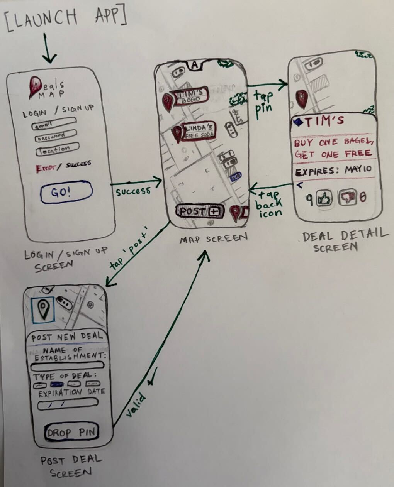

Original App Design Project - README Template
===

# Local Deals Live Map

## Table of Contents

1. [Overview](#Overview)
2. [Product Spec](#Product-Spec)
3. [Wireframes](#Wireframes)
4. [Schema](#Schema)

## Overview

### Description

Local Deals Live Map is a community-driven mobile app that helps users discover nearby deals and discounts in real time. Users can view deals on an interactive map, submit their own deals, and see important details such as discount type and expiration. The app centralizes local savings opportunities that are often hard to find.

### App Evaluation

- **Category:** Lifestyle / Community-driven map app  
- **Mobile:** Mobile-first application that uses maps, GPS/location services, camera (for deal photos), and push notifications  
- **Story:** People frequently miss nearby deals because promotions are scattered or only visible in-store. This app helps users discover and share local deals in one centralized platform  
- **Market:** Broad audience of local shoppers, starting with Monterey County and scalable to other regions  
- **Habit:** Users may check the app multiple times per week when planning purchases; contributors may use it more frequently  
- **Scope:** Narrow initial scope (map + deals), with clear expansion opportunities such as voting, saved deals, notifications, and AI-powered recommendations  

Product spec · MD
# Product Spec
 
---
 
## 1. User Stories
 
### Required Must-Have Stories
 
* User can view nearby deals displayed as pins on a map within a 10-mile radius of a location they plan to be around or want to go to, with traffic and walking time factored into results
* User can tap on a pin to view a deal card where the most important information — discount amount, store name, and expiration — is visually prioritized so it can be understood at a fast glance, with additional details available below
* User can add a new deal with location, description, and expiration — new deals are visible to all users when they are nearby or when the deal matches a filter they search with
 
### Optional Nice-to-Have Stories
 
Difficulty is rated using **Fibonacci Story Points**, the industry-standard Agile estimation scale:
`1` = trivial · `3` = simple · `5` = moderate · `8` = complex · `13` = large/high effort · `21` = very large, consider breaking apart
 
* **5 pts** — User can upvote or downvote deals to verify accuracy — requires vote tracking, duplicate vote prevention, and updating deal credibility scores
* **8 pts** — User can upload photos of deals using their camera — requires device camera API access, image compression, and cloud storage integration
* **13 pts** — User can receive push notifications when deals are nearby — requires background location monitoring, notification scheduling, and a push delivery service
* **8 pts** — User can create an account to track their contributions; guest browsing is available with extreme limitations on content creation — requires full auth system (login, session management, roles)
* **3 pts** — User can save/bookmark deals — saved cards update to reflect expiration status and display the date the user saved them — requires persistent local or cloud storage with time-aware state
* **13 pts** — User can receive AI-based deal recommendations (Gemini integration) — requires prompt engineering, API integration, and personalization logic based on user behavior
 
---

## Demo


## Current Progress

- (#38) Implemented map picker for selecting deal location in AddDealView  
- (#36) Loaded saved and submitted deals in ProfileView from Firestore  
- (#35) Implemented Firebase Authentication (email/password + Google OAuth)  
- (#34) Wired up Save Deal button in DealDetailView  
- (#33) Loaded deals from Firestore instead of hardcoded sample data  
- (#32) Fixed save deals functionality using userDeals collection  
- (#31) Implemented CoreLocation as default camera centering view  
- (#30) Fixed cancel button behavior in AddDealView  
- (#29) Fixed dead-end screen when submitting a deal  
- (#28) Completed login/authentication setup and user session handling  
- (#26) Allowed user to pick a location on the map when creating a deal  
- (#25) Displayed user location on map when app launches  
- (#20) Scaffolded core app views (Map, Add Deal, Profile)  
- (#19) Integrated Firebase Authentication system  
- (#18) Integrated MapKit for map display  
- (#17) Implemented Firestore database schema  
- (#16) Completed Firebase project setup  
- (#15) Implemented tab navigation and screen flow  
- (#12) Implemented save/bookmark deals feature  
- (#7) Integrated Maps API setup  
- (#6) Implemented backend deal data model (Firestore)  
- (#5) Built Add Deal screen with submission flow  
- (#4) Built Deal Detail screen  
- (#3) Implemented Map screen with deal pins  
 
## 2. Screen Archetypes
 
- [ ] **Map Screen (Home)**
  * Required: User can view nearby deals on a map
  * Required: User can tap a deal pin to view details
 
```
+----------------------------------------------------------+
|  📍 Enter a location... Current          [ 🔍 Search ] |
+----------------------------------------------------------+
|                                                          |
|        .  .  .  .  .  .  .  .  .  .  .  .  .  .        |
|      .                                             .      |
|    .         📌 Starbucks                           .    |
|   .          (25% off)                               .   |
|  .                                                    .  |
|  .                    📌 Target                       .  |
|  .                    (BOGO)                          .  |
|  .                                                    .  |
|   .              ★ YOU ARE HERE ★                    .   |
|    .                                                .    |
|    .      📌 Chipotle                               .    |
|     .     ($5 bowl)                               .      |
|       .                                         .        |
|         .  .  .  .  .  .  .  .  .  .  .  .  .          |
|                                          [ + Add Deal ]  |
+----------------------------------------------------------+
|  [   🗺  Map   ]    [  ➕  Add Deal  ]   [  👤 Profile ] |
+----------------------------------------------------------+
```
 
- [ ] **Deal Detail Screen**
  * Required: User can view detailed information about a deal
  * Optional: User can save/bookmark a deal
 
- [ ] **Add Deal Screen**
  * Required: User can submit a new deal
 
- [ ] **Profile Screen**
  * Optional: User can view saved/bookmarked deals
  * Optional: User can view previously submitted deals
 
---
 
## 3. Navigation
 
### Tab Navigation
 
```
+------------------------------------------+
|                                          |
|              [Screen Content]            |
|                                          |
+------------------------------------------+
|  [  Map  ]   [ + Add Deal ]  [ Profile ] |
+------------------------------------------+
```
 
```
+------------------------------------------+
|  Deal Card View                          |
|  +------------------------------------+  |
|  |  Store Name         💾 Save        |  |
|  |  📍 0.3 mi  |  ⏱ 5 min walk       |  |
|  |  20% off all items                 |  |
|  |  Expires: Apr 18, 2026             |  |
|  +------------------------------------+  |
|  +------------------------------------+  |
|  |  Store Name         💾 Save        |  |
|  |  📍 1.1 mi  |  🚗 4 min drive      |  |
|  |  Buy 1 Get 1 Free                  |  |
|  |  Expires: Apr 20, 2026             |  |
|  +------------------------------------+  |
+------------------------------------------+
|  [  Map  ]   [ + Add Deal ]  [ Profile ] |
+------------------------------------------+
```
 
---
 
### Flow Navigation
 
**Map Screen**
```
[ Map Screen ]
      |
      |-- (tap a pin) ---------> [ Deal Detail Screen ]
      |
      +-- (tap add button) ----> [ Add Deal Screen ]
```
 
**Deal Detail Screen**
```
[ Deal Detail Screen ]
      |
      |-- (back) --------------> [ Map Screen ]
      |
      +-- (save/view saved) ---> [ Profile Screen ]
```
 
**Add Deal Screen**
```
[ Add Deal Screen ]
      |
      +-- (submit or cancel) --> [ Map Screen ]
```
 
**Profile Screen**
```
[ Profile Screen ]
      |
      +-- (tap saved/posted) --> [ Deal Detail Screen ]
```
 
---
 
## Wireframes


 
### [BONUS] Digital Wireframes & Mockups
 
### [BONUS] Interactive Prototype

## Schema 

> ⚠️ Note: The following schema is preliminary and subject to change as the app design evolves. It represents our current brainstorming and may be refined during implementation.


### Deal (Firestore: `deals` collection)

| Property        | Type      | Description |
|----------------|----------|------------|
| id             | String   | document ID |
| title          | String   | deal title |
| businessName   | String   | business name |
| description    | String   | deal description |
| discountType   | String   | type of discount |
| expiration     | Date     | expiration date |
| imageUrl       | String   | optional image |
| location       | GeoPoint | latitude + longitude |
| votes          | Int      | vote count |
| createdByUid   | String   | user ID |
| createdByEmail | String   | creator email |
| createdAt      | Date     | creation timestamp |

---

### User (Firestore: `users` collection)

| Property     | Type    | Description |
|--------------|--------|------------|
| id           | String | Firebase UID |
| email        | String | user email |
| username     | String | username |
| displayName  | String | display name |
| photoURL     | String | profile image |
| provider     | String | auth provider |
| createdAt    | Date   | account creation |
| lastLoginAt  | Date   | last login |

---

### UserDeal (Firestore: `userDeals` collection)

| Property      | Type    | Description |
|---------------|--------|------------|
| id            | String | document ID |
| userId        | String | reference to user |
| dealId        | String | reference to deal |
| relationType  | String | "saved" or "created" |
| createdAt     | Date   | timestamp |

---

### App Metadata (Firestore: `appMetadata` collection)

| Property   | Type    | Description |
|------------|--------|------------|
| seeded     | Bool   | whether mock data inserted |
| seedName   | String | seed identifier |
| dealIDs    | Array  | seeded deal IDs |
| createdAt  | Date   | timestamp |

---

### Networking

- Firestore real-time listeners used for deals and saved data  
- Firebase Authentication handles login and session state  
- CoreLocation provides user location  
- MapKit renders map and annotations  

---

## Sprint 3 Plan

### Goal

Enhance usability, personalization, and real-world usefulness of the app by improving discovery features and user interaction with deals.

### Planned Features

- Display real distance from user to each deal using CoreLocation  
- Allow users to tap a deal in Profile and center it on the map  
- Add user-configurable proximity radius setting for future notifications  
- Implement map filtering by discount type (BOGO, %, Dollar Off, etc.)  
- Improve expired deal handling with clear UI indicators  

### Stretch Goals

- Integrate Gemini API to assist with generating deal descriptions or recommendations  
- Implement push notifications for nearby deals based on user proximity settings  
- Add image upload support for deals using Firebase Storage  

### Success Criteria

- Users can more easily discover relevant nearby deals  
- Map interactions feel responsive and intuitive  
- Profile screen becomes a useful navigation tool, not just a list  
- App demonstrates advanced features beyond basic CRUD + map display  

---

## Summary

The app is now a fully functional MVP with:
- Firebase Authentication and Firestore backend  
- Real-time data updates  
- Map-based deal discovery  
- User interaction through saving and submitting deals 

---

## Code Highlights

### Save / Unsave a Deal (DealManager)
Saved deal IDs are tracked in a `Set<String>` synced with Firestore via the `userDeals` collection. Toggling a save writes or deletes the relationship document in real time.

```swift
func toggleSave(deal: Deal, userID: String) async {
    let query = try await database.collection("userDeals")
        .whereField("userId", isEqualTo: userID)
        .whereField("dealId", isEqualTo: deal.id)
        .whereField("relationType", isEqualTo: "saved")
        .getDocuments()

    if let existing = query.documents.first {
        try await database.collection("userDeals")
            .document(existing.documentID).delete()
    } else {
        try await database.collection("userDeals").addDocument(data: [
            "userId": userID,
            "dealId": deal.id,
            "relationType": "saved",
            "createdAt": Timestamp(date: Date())
        ])
    }
}
```

### Deal Detail Card (DealDetailView)
Hero section puts the discount title front and center with an accent background. Info pills surface the key facts at a glance.

```swift
// Hero card
VStack(spacing: 8) {
    Text(deal.title)
        .font(.largeTitle).fontWeight(.bold)
        .multilineTextAlignment(.center)
    Label(deal.businessName, systemImage: "storefront")
        .font(.title3).foregroundColor(.secondary)
}
.frame(maxWidth: .infinity)
.padding(24)
.background(Color.accentColor.opacity(0.12))

// Info pills
HStack(spacing: 10) {
    InfoPill(icon: "tag",      text: deal.discountType)
    InfoPill(icon: "clock",    text: formattedExpiration)
    InfoPill(icon: "location", text: "— mi")
}
```

### Form Reset on Submit / Cancel (AddDealView)
`resetForm()` clears all fields after submission and on cancel. `dismiss()` fires when the view is a sheet; it's a no-op when embedded as a tab — `resetForm()` handles that case.

```swift
private func resetForm() {
    title = ""
    businessName = ""
    description = ""
    latitudeText = ""
    longitudeText = ""
    expiration = Date()
    discountType = "Percent Off"
    imageUrl = ""
    selectedCoordinate = nil
}
```

### Real-time Saved Deals Listener (DealManager)
On auth change, the listener attaches to the current user's `userDeals` documents and keeps `savedDealIDs` in sync so the bookmark state reflects immediately across all views.

```swift
func handleAuthChange(userID: String?) {
    userDealsListener?.remove()
    savedDealIDs = []
    guard let userID else { return }

    userDealsListener = database.collection("userDeals")
        .whereField("userId", isEqualTo: userID)
        .whereField("relationType", isEqualTo: "saved")
        .addSnapshotListener { [weak self] snapshot, _ in
            let ids = snapshot?.documents
                .compactMap { $0.data()["dealId"] as? String } ?? []
            self?.savedDealIDs = Set(ids)
        }
}
```
